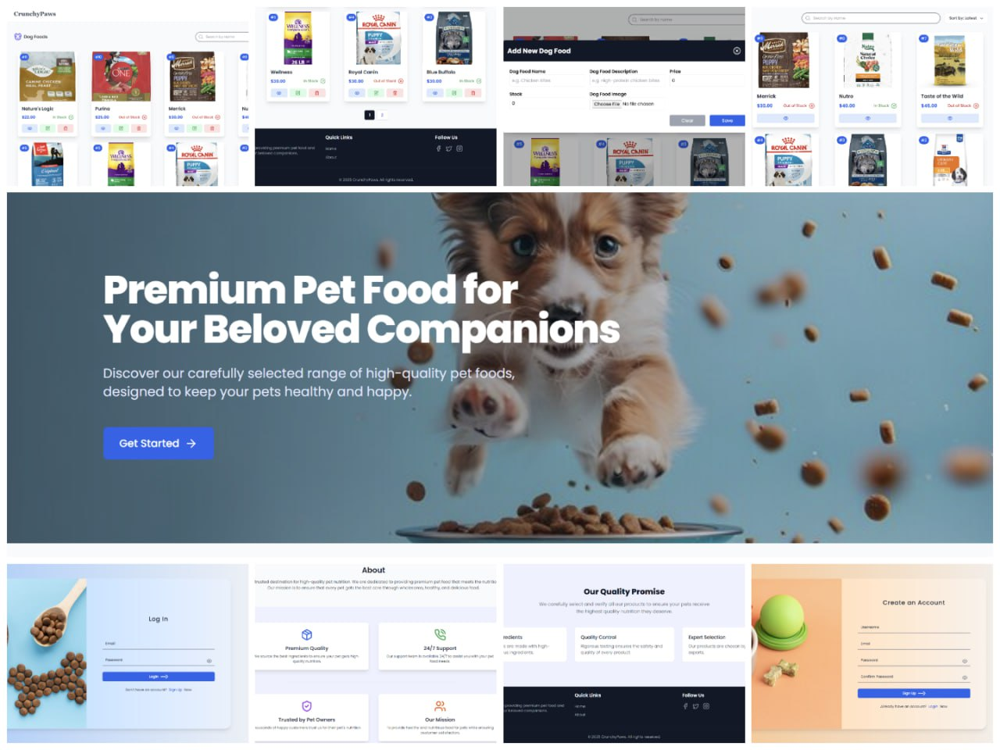

<div align="center">
  
<h2>Pet-Food-Store-Frontend</h2>
</div>

## Introduction
The **CrunchyPaws** frontend is built using **React, TypeScript, Redux, Redux Thunk, and Tailwind CSS** to provide a seamless and user-friendly interface for managing pet food products. This application allows users to explore a variety of **high-quality cat and dog food** while ensuring a smooth and interactive browsing experience. The frontend interacts with the backend API for authentication, user roles, and product management.

This platform prioritizes **ease of use, efficiency, and responsiveness**, making **CrunchyPaws** a reliable pet food store for pet owners and administrators alike.

#### User Interface

<div>
  
</div>

## Technologies Used
- **React**
- **TypeScript**
- **Redux**
- **Redux Thunk**
- **Tailwind CSS**
- **Vite**

## Features
- **Admin Features:** Add, update, and delete cat and dog food items.
- **User Access:** View available pet food products without modification privileges.
- **Authentication:** Secure login with JWT and refresh tokens.

## Backend Repository Link
[CrunchyPaws Backend Repository](https://github.com/yasith-chathuranga/pet-food-store-backend.git)

## License
This project is licensed under the **MIT License**. See the [LICENSE](LICENSE) file for details.

## Getting Started

### Prerequisites
To run this project, ensure you have the following installed:
- **Node.js**
- **TypeScript**
- **Vite**
- **React**
- **An IDE (Integrated Development Environment)**

### Running the Application
1. **Clone the repository:**
   ```bash
   git clone https://github.com/yasith-chathuranga/pet-food-store-frontend.git
   cd pet-food-store-frontend
   ```

2. **Install dependencies:**
   ```bash
   npm install
   ```

3. **Start the application:**
   ```bash
   npm run dev
   ```

<div align="center">
<a href="https://react.dev/" target="_blank"></a>
<a href="https://www.typescriptlang.org/" target="_blank"></a>
<a href="https://redux.js.org/" target="_blank"></a>
<a href="https://tailwindcss.com/" target="_blank"></a>
<a href="https://vitejs.dev/" target="_blank"></a>
<a href="https://github.com/yasith-chathuranga" target="_blank"></a>
<a href="https://git-scm.com/" target="_blank"></a>
</div>

<br>
<p align="center">
  &copy; 2025 Yasith Chathuranga
</p>